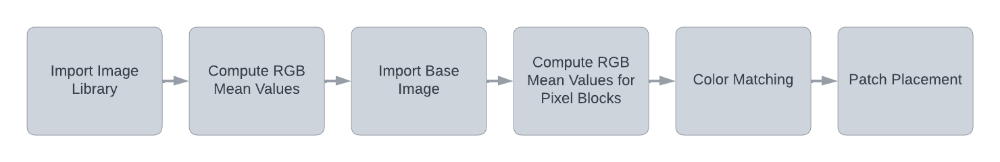
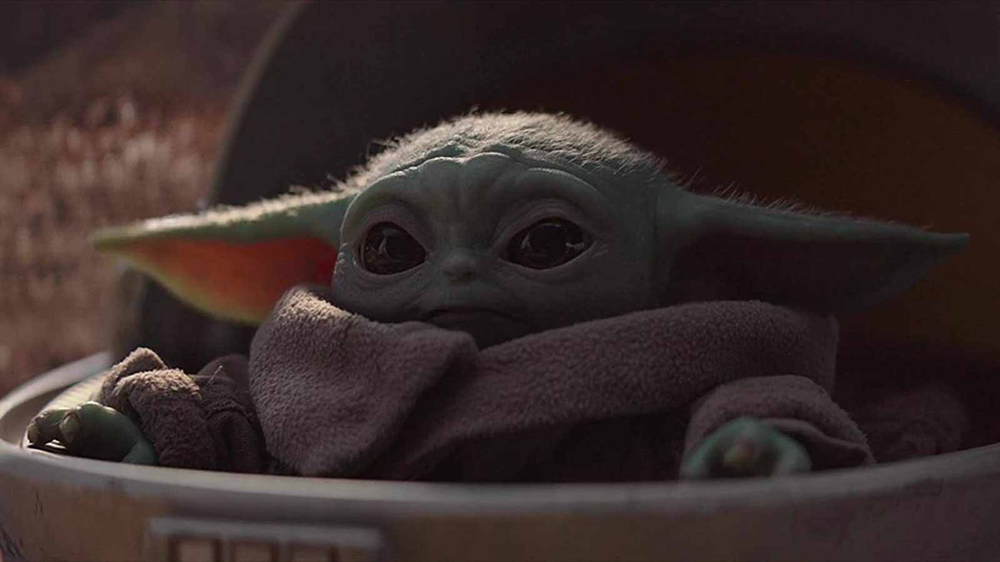
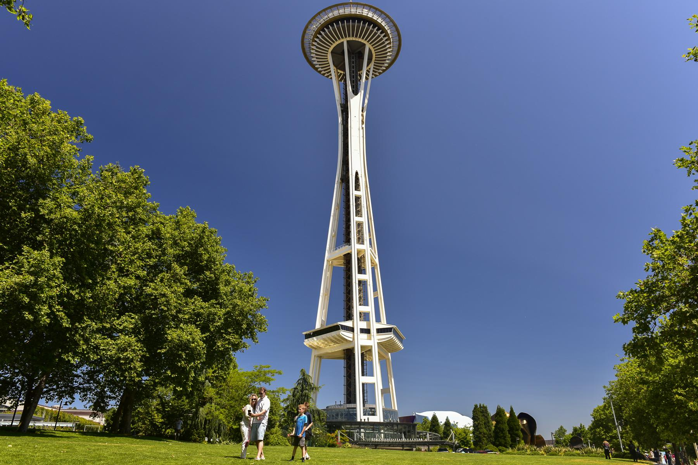

# High-performance Image Processing with MATLAB

## Table of Contents
- [Project Overview](#project-overview)
- [Repository Structure](#repository-structure)
- [Project Objectives](#project-objectives)
- [Code Pipeline](#code-pipeline)
- [System Design](#system-design)
- [Installation and Usage](#installation-and-usage)
- [Results](#results)
- [Achievements](#achievements)
- [Future Work](#future-work)

## Project Overview
This MATLAB project aims to create a complex and intriguing program that collages a library of photos onto a base image. After learning the MATLAB basics, the goal was to utilize those skills to create a unique and exciting project. 

## Repository Structure

| Project Directories | Brief Description |
|---|---|
| [`/src`](./src) | Contains the source code for the project. |
| [`/src/images`](./src/images) | Contains the images used for creating the photo collage and the code pipeline. It is further subdivided into [`/base_images`](./src/images/base_images) and [`/image_library`](./src/images/image_library) |
| [`/src/Collagifier.m`](./src/Collagifier.m) | This is the main MATLAB script that runs the photo collage creation process. |
| `README.md` | This file contains detailed information about the project, its architecture, and its usage. |

## Project Objectives
The main objectives of this project are:
- To apply the image manipulation concepts with MATLAB in a practical project.
- To gain a deeper understanding of image processing techniques.
- To create an interesting visual piece using a set of images and a base image.

## Code Pipeline

   
  <em>Fig.0 - Abstract pipeline.</em>

The project follows a series of steps that constitute the pipeline of the code:

1. **Import Image Library**: The set of images to be used for the collage are imported.
2. **Compute RGB Mean Values**: For each imported image, the mean values of RGB are calculated.
3. **Import Base Image**: The image onto which the collage will be created is imported.
4. **Compute RGB Mean Values for Pixel Blocks**: The mean RGB values of 20x20 pixel blocks of the original image are computed.
6. **Color Matching**: The average RGB value of each library image is matched to the nearest RGB value of a 20x20 pixel block in the original image.
7. **Patch Placement**: The corresponding library image is patched onto the correct 20x20 pixel block in the base image.

## System Design
The photo collage system was designed to bring together a collection of images into a singular, cohesive visual piece. It is based on matching color patterns between small blocks of a base image and the images in a library, creating a mosaic effect. The result is a detailed and vibrant representation of the original image.

## Installation and Usage
To run this application, MATLAB needs to be installed on your computer. After cloning the repository to your local machine and navigating to the project directory, you can run the main script to start the photo collage creation process.

## Results
| Original Image | Result Image |
|:---:|:---:|
|  |  |
|  |  |
|  |  |

## Achievements
Through this project, we have created a unique way of collaging a set of images onto a base picture, creating an engaging and eye-catching result. This project enhances our understanding of image processing and manipulation using MATLAB.

## Future Work
While the current version of the application fulfills the specified requirements, there are several potential enhancements that could make it more robust and user-friendly:
- Addition of a user interface to allow for easy selection of the base image and image library.
- Optimization of the color matching algorithm for better performance.
- Exploring different patch sizes to create a variety of effects.
